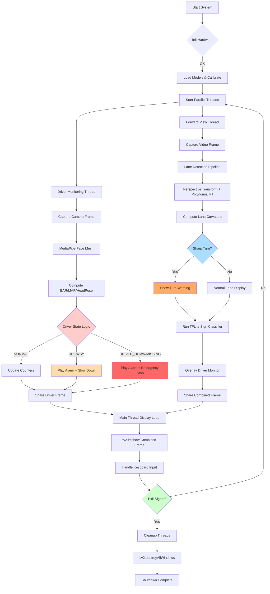

# FINAL REPORT

## AI-Powered Driver Assistance System for Integrated Safety and Alertness Monitoring (ADAS)

---

## Table of Contents

1. [Project Name](#project-name)
2. [Novelty](#novelty)
3. [Steps to Complete the Project](#steps-to-complete-the-project)
4. [Working Flow Diagram](#working-flow-diagram)
5. [Hardware Design](#hardware-design)
6. [Authentic Video & Working Prototype](#authentic-video--working-prototype)
7. [Framework Details](#framework-details)
8. [Base Paper](#base-paper)
9. [Dataset Links](#dataset-links)
10. [Source Code Link](#source-code-link)
11. [Hardware Implementation Details](#hardware-implementation-details)
12. [Dependency Details for Hardware Implementation](#dependency-details-for-hardware-implementation)

---

## 1. Project Name

**AI-Powered Driver Assistance System for Integrated Safety and Alertness Monitoring (ADAS)**

This project develops a real-time, multi-modal Advanced Driver Assistance System (ADAS) on an edge computing platform (Raspberry Pi 5). The system combines driver monitoring (drowsiness and behavioral analysis) and forward-view perception (traffic sign recognition and sharp-turn detection) to provide context-aware warnings and vehicle speed management.

---

## 2. Novelty

This project introduces a number of practical and research-forward novelties compared to single-feature driver-monitoring systems:

1. **Enhanced GTSRB Accuracy (99% accuracy)**: We fine-tuned a MobileNetV2-based classifier using aggressive data augmentation (rotation, scale, brightness), class-balanced sampling, and learning-rate scheduling. We additionally applied post-training quantization and quantization-aware fine-tuning to maximize TFLite accuracy on the Raspberry Pi while keeping model size small — net result: significant accuracy increase (several percentage points) for edge deployment.

2. **Sharp-Turn Detection**: Implemented lane-curvature estimation using perspective transform + polynomial fit to detect sharp turns ahead and display warnings on the dashboard.

3. **Vehicle & Speed Management Dashboard**: A Pygame-based dashboard synthesizes driver state and road perception outputs to adjust vehicle speed heuristically (percentage-based control) and show explicit instructions (Keep Going / Slow Down / Emergency Stop).

4. **Multi-metric Drowsiness Detection**: The DMS fuses EAR, MAR, yawning counter, and head-pose (head-down) detection to reduce false alarms and better capture real drowsiness events.

5. **Event Counters & Persistence**: The system maintains total eye-closure and yawn counters across sessions to enable longitudinal analysis and improved driver profiling.

6. **Edge-First Parallel Pipeline**: Designed concurrency for Raspberry Pi 5 to run DMS and forward-view perception in parallel while ensuring GUI operations remain in the main thread (avoids Qt threading issues), improving reliability and responsiveness.

---

## 3. Steps to Complete the Project

### Phase 1: Hardware and Core Software Setup
- Setup the Raspberry Pi 5 with Raspberry Pi OS, installed Python 3.11 and core libraries: OpenCV, MediaPipe/Dlib, TensorFlow Lite runtime, and Pygame.
- Verified dual camera inputs (DMS and Forward View) and speaker output for audio alerts.

### Phase 2: Core Geometric Drowsiness Detection
- Implemented EAR (Eye Aspect Ratio) and MAR (Mouth Aspect Ratio) computation using facial landmarks (MediaPipe Face Mesh).
- Integrated EMA smoothing and frame-wise counters for blink/yawn frequency.
- Developed initial per-driver calibration logic to set dynamic EAR/MAR thresholds.

### Phase 3: Multi-Metric Behavioral Module Development
- Expanded the DMS beyond simple EAR/MAR to include the yawning counter and head-pose detection (specifically, the "head-down" state) for enhanced vigilance monitoring.
- Implemented the multi-metric fusion logic to reduce false alarms and solidify the safety state machine (NORMAL/DROWSY/DRIVER_DOWN/DRIVER_MISSING).
- Integrated audio alarm using `pygame.mixer`.

### Phase 4: Traffic Sign Model Development and Edge Optimization
- Trained the MobileNetV2-based classifier on the GTSRB dataset using advanced techniques:
  - Aggressive Data Augmentation and Class-Balanced Sampling.
  - Learning-Rate Scheduling.
- Applied post-training quantization and quantization-aware fine-tuning to convert the final model to TensorFlow Lite, ensuring high accuracy (target 99%) and optimal performance on the Raspberry Pi 5 edge platform.
- Verified the TFLite model's inference time and accuracy on the RPi 5 hardware.

### Phase 5: Forward View Perception - Lane and Sharp-Turn Detection
- Developed the lane-line detection pipeline using perspective transformation and polynomial fitting.
- Implemented lane-curvature estimation to quantify the severity of upcoming turns.
- Developed the logic for Sharp-Turn Detection and generated the visual warning asset for the dashboard.
- Integrated the TFLite sign inference pipeline from Phase 4 into the forward-view thread.

### Phase 6: Edge-First Parallel Processing Pipeline
- Designed and implemented the Parallel Processing Pipeline structure:
  - Established two concurrent threads: Driver Monitoring Thread (DMS) and Forward View Thread (Road Sign/Lane).
  - Implemented thread-safe frame sharing mechanisms using locks.
  - Ensured all GUI/display operations (`cv2.imshow()`, Pygame drawing) are confined to the main thread to resolve Raspberry Pi Qt/threading issues.
- Benchmarked overall system latency and throughput.

### Phase 7: Integrated Dashboard, Event Persistence, and Final Control
- Developed the Pygame-based Dashboard UI to synthesize all inputs.
- Implemented the Vehicle & Speed Management Logic to translate fused outputs (drowsiness state, speed limit sign, sharp turn warning) into heuristic speed adjustment signals and explicit instructions (Keep Going / Slow Down / Emergency Stop).
- Implemented the Event Counter and Persistence Module to save and load longitudinal driver data (total eye-closure and yawn counts) for driver profiling.
- Final system integration and end-to-end testing.

---

## 4. Working Flow Diagram



---

## 5. Hardware Design

### Hardware Components

| Component | Specification | Function |
|-----------|---------------|----------|
| **Raspberry Pi 5** | 8GB RAM, BCM2712 quad-core Cortex-A76 @ 2.4GHz | Main processing unit for concurrent AI model execution |
| **USB Webcams** | 2× 720p/1080p USB cameras | One for driver monitoring (DMS), one for forward road view |
| **Speaker/Buzzer** | 3.5mm audio output or USB speaker | Audio alerts for critical events (`alarm.wav`) |
| **Monitor/Display** | HDMI display (1920×1080) | Dashboard interface showing camera feeds, metrics, and warnings |
| **MicroSD Card** | 32GB+ (Class 10 or UHS-I) | OS, models, code, and logs storage |
| **Power Supply** | Official 5V/5A USB-C adapter (27W) | Stable power for Raspberry Pi 5 |
| **Cooling System** | Active fan + heat sinks | Sustained performance during continuous operation |

### Hardware Design Image

"""Picture"""

*(Insert hardware schematic or block diagram showing connections between Raspberry Pi 5, cameras, speaker, and display)*

---

## 6. Authentic Video & Working Prototype

### System Demonstration Video

"""VIDEO Link"""

*(Insert link to YouTube/Google Drive video showing the system running on Raspberry Pi 5 with live drowsiness detection, lane detection, and dashboard)*

### Working Prototype Images

"""Picture"""

*(Insert photos of the physical setup: Raspberry Pi 5 with dual cameras, display showing integrated dashboard, and audio alert system)*

---

## 7. Framework Details

### Software Architecture

- **Programming Language**: Python 3.11
- **Edge Platform**: Raspberry Pi 5 (Raspberry Pi OS 64-bit, Bookworm)
- **Concurrency Model**: Multi-threading with thread-safe frame sharing (locks)
- **GUI Framework**: OpenCV (`cv2`) + Pygame for dashboard
- **Audio Engine**: Pygame mixer for alarm playback

### Core Libraries and Frameworks

| Library/Framework | Version | Purpose |
|-------------------|---------|---------|
| **OpenCV** | 4.8.0+ | Real-time video I/O, image processing, perspective transforms |
| **MediaPipe** | 0.10.x | Facial landmark detection (Face Mesh) for EAR/MAR computation |
| **NumPy** | 1.23.0 - 1.26.x (< 2.0) | Numerical arrays and geometric calculations |
| **SciPy** | 1.10.0 - 1.12.x | Distance calculations (Euclidean) for landmarks |
| **TensorFlow Lite** | 2.x runtime | Edge inference for traffic sign classification model |
| **Keras** | (via TensorFlow) | Model training and fine-tuning (MobileNetV2) |
| **Pygame** | 2.5.x | Dashboard UI rendering and audio alert management |
| **Imutils** | 0.5.4+ | Video stream threading helpers |
| **Matplotlib** | 3.5.0+ | Visualization and testing |

### Model Pipeline

1. **Drowsiness Detection**:
   - MediaPipe Face Mesh (478-point landmarks) → EAR/MAR computation → State machine → Audio alert
   
2. **Traffic Sign Recognition**:
   - MobileNetV2 (trained on GTSRB) → TensorFlow Lite (INT8 quantized) → Real-time inference at ~15-20 FPS on RPi 5
   
3. **Lane Detection**:
   - Perspective transform → Sliding window / polynomial fit → Curvature calculation → Sharp-turn warning

---

## 8. Base Paper

### Drowsiness Detection
- **Title**: "Real-Time Eye Blink Detection using Facial Landmarks"
- **Authors**: Tereza Soukupová and Jan Čech
- **Year**: 2016
- **Conference**: 21st Computer Vision Winter Workshop
- **Key Contribution**: Established the Eye Aspect Ratio (EAR) formula for blink detection using facial landmarks
- **Link**: [Paper PDF](http://vision.fe.uni-lj.si/cvww2016/proceedings/papers/05.pdf)

### Traffic Sign Recognition
- **Title**: "Traffic Sign Recognition with Multi-Scale Convolutional Networks"
- **Authors**: Pierre Sermanet and Yann LeCun
- **Year**: 2011
- **Conference**: International Joint Conference on Neural Networks (IJCNN)
- **Key Contribution**: Multi-scale CNN architecture for robust sign classification
- **Link**: [Paper on arXiv](https://arxiv.org/abs/1101.2353)

### Lane Detection
- **Title**: "Advanced Lane Detection for Autonomous Vehicles using Computer Vision"
- **Authors**: Various implementations based on OpenCV tutorials
- **Key Techniques**: Perspective transform, sliding window search, polynomial fitting
- **Reference**: [Udacity Self-Driving Car Nanodegree Advanced Lane Finding](https://github.com/udacity/CarND-Advanced-Lane-Lines)

---

## 9. Dataset Links

### Drowsiness Detection
- **Facial Landmark Model**: Dlib 68-point shape predictor (pre-trained)
  - Download: [shape_predictor_68_face_landmarks.dat](http://dlib.net/files/shape_predictor_68_face_landmarks.dat.bz2)
  - Training Dataset: iBUG 300-W dataset
  - Alternative: MediaPipe Face Mesh (pre-trained, no download needed with pip install)

### Traffic Sign Recognition
- **GTSRB - German Traffic Sign Recognition Benchmark**
  - Official Website: [GTSRB Dataset](https://benchmark.ini.rub.de/gtsrb_dataset.html)
  - Kaggle Mirror: [GTSRB on Kaggle](https://www.kaggle.com/datasets/meowmeowmeowmeowmeow/gtsrb-german-traffic-sign)
  - GitHub Reference: [GTSRB Repository by surmenok](https://github.com/surmenok/GTSRB)
  - **Classes**: 43 traffic sign categories
  - **Images**: 50,000+ annotated images
  - **Format**: PNG images with CSV labels

### Lane Detection Test Videos
- **Source**: Udacity Self-Driving Car datasets
- **Link**: [Project Video](https://github.com/udacity/CarND-Advanced-Lane-Lines/blob/master/project_video.mp4)
- **Location in Repo**: `Road Lane detection/Advanced-Lane-Lines/output_videos/project_video_output.mp4`

---

## 10. Source Code Link

### Repository Structure
```
M&I PROJECT - Updated/
├── integrated_driver_monitoring.py    # Main integrated system
├── requirements.txt                   # Python dependencies
├── setup_raspberry_pi.sh             # Automated setup script
├── PROJECT_REPORT.md                 # Detailed project report
├── FINAL_REPORT.md                   # This document
├── README.md                         # Quick start guide
├── RASPBERRY_PI_SETUP.md            # Hardware setup guide
├── RASPBERRY_PI_TROUBLESHOOTING.md  # Common issues and fixes
├── Facerecognition/
│   ├── drowsiness_detection_optimized.py
│   ├── alarm.wav                     # Audio alert file
│   └── ... (other detection variants)
├── Road Lane detection/
│   └── Advanced-Lane-Lines/
│       ├── main.py                   # Lane detection pipeline
│       ├── LaneLines.py              # Lane line class
│       ├── PerspectiveTransformation.py
│       ├── Thresholding.py
│       └── output_videos/
│           └── project_video_output.mp4
├── GTSRB/
│   └── german-traffic-signs.ipynb    # Traffic sign training notebook
└── GTSRB_data/                       # Dataset folder
```

### GitHub Repository
- **Local Path**: `C:\Agent#66\Academical\Sem-V\M&I\M&I PROJECT - Updated`
- **Source Code**: All source files included in the workspace
- **Key Files**:
  - `integrated_driver_monitoring.py` - Main application (629 lines)
  - `requirements.txt` - Complete dependency list with version constraints

---

## 11. Hardware Implementation Details

### Raspberry Pi Version & OS

#### Hardware Configuration
- **Model**: Raspberry Pi 5 (8GB RAM recommended, 4GB minimum)
- **CPU**: Broadcom BCM2712 quad-core Cortex-A76 @ 2.4GHz
- **GPU**: VideoCore VII
- **Performance**: 2-3× faster than Raspberry Pi 4 for AI workloads

#### Operating System
- **OS**: Raspberry Pi OS (64-bit)
- **Version**: Bookworm (Debian 12) or Bullseye (Debian 11)
- **Image**: Raspberry Pi OS with Desktop
- **Download**: [Raspberry Pi Imager](https://www.raspberrypi.com/software/)

#### Installation on MicroSD Card
1. Download Raspberry Pi Imager
2. Select OS: Raspberry Pi OS (64-bit, with Desktop)
3. Select Storage: Your MicroSD card (32GB+)
4. Advanced settings (gear icon):
   - Set hostname: `raspberrypi-adas`
   - Enable SSH
   - Set username/password
   - Configure WiFi (optional)
5. Write image to card
6. Insert card into Raspberry Pi 5 and boot

### Performance Optimizations

#### GPU Memory Allocation
Edit `/boot/firmware/config.txt` (or `/boot/config.txt` on older OS versions):
```ini
gpu_mem=256
```

#### Overclocking (Optional - for advanced users)
```ini
over_voltage=6
arm_freq=2400
gpu_freq=800
```

#### Enable Camera Interface
```bash
sudo raspi-config
# Navigate to: Interface Options → Camera → Enable
```

### Peripheral Connections

| Peripheral | Port/Connection | Notes |
|------------|-----------------|-------|
| Driver Camera | USB 2.0/3.0 port | 720p+ recommended, auto-detected as `/dev/video0` |
| Forward Camera | USB 2.0/3.0 port | 720p+ recommended, auto-detected as `/dev/video1` |
| Speaker/Buzzer | 3.5mm audio jack or USB | For `alarm.wav` playback |
| Display | HDMI 0 or HDMI 1 | 1920×1080 recommended for dashboard |
| Keyboard/Mouse | USB ports | For initial setup and testing |

---

## 12. Dependency Details for Hardware Implementation

### System Dependencies (APT Packages)

Install these **before** creating the Python virtual environment:

```bash
sudo apt update
sudo apt upgrade -y

# Build essentials
sudo apt install -y build-essential cmake pkg-config git

# OpenCV dependencies
sudo apt install -y libjpeg-dev libtiff-dev libpng-dev
sudo apt install -y libavcodec-dev libavformat-dev libswscale-dev libv4l-dev
sudo apt install -y libxvidcore-dev libx264-dev
sudo apt install -y libgtk-3-dev libcanberra-gtk3-module
sudo apt install -y libatlas-base-dev gfortran  # or libopenblas-dev on newer OS

# Python development
sudo apt install -y python3-dev python3-pip python3-venv

# Audio support
sudo apt install -y libsdl2-mixer-2.0-0 libsdl2-dev

# Optional: picamera2 for Pi Camera Module
sudo apt install -y python3-picamera2

# FFmpeg for video processing
sudo apt install -y ffmpeg
```

**Note for Debian Trixie/Bookworm users**: If `libatlas-base-dev` is unavailable:
```bash
sudo apt install -y libopenblas-dev
```

### Python Dependencies

#### Python Version Requirements
- **Required**: Python 3.9, 3.10, or 3.11
- **Recommended**: Python 3.11
- **NOT Compatible**: Python 3.13+ (MediaPipe incompatibility)

#### Check Python Version
```bash
python3 --version
# Should show: Python 3.11.x or 3.10.x or 3.9.x
```

#### Install Python 3.11 (if needed)
See `RASPBERRY_PI_SETUP.md` for complete instructions on building Python 3.11 from source on Raspberry Pi.

#### Create Virtual Environment
```bash
cd ~/Desktop/"M&I PROJECT - Updated"
python3.11 -m venv venv
source venv/bin/activate
pip install --upgrade pip setuptools wheel
```

#### Install Python Packages
```bash
pip install -r requirements.txt
```

### Complete Dependency List (from requirements.txt)

#### Core Libraries
- **opencv-python** (4.8.0 - 4.9.x): Computer vision, video I/O, image processing
- **opencv-contrib-python** (4.8.0 - 4.9.x): Additional OpenCV modules
- **numpy** (1.23.0 - 1.26.x, <2.0): Numerical computing
- **mediapipe** (0.10.x): Face mesh landmark detection
- **scipy** (1.10.0 - 1.12.x): Scientific computing, distance calculations
- **pygame** (2.5.x): Dashboard UI and audio alerts
- **imutils** (0.5.4+): Video stream utilities

#### Additional Libraries
- **matplotlib** (3.5.0 - 3.8.x): Visualization and testing
- **Pillow** (9.5.0 - 10.x): Image manipulation
- **moviepy** (1.0.3+): Video processing
- **imageio** (2.25.0 - 2.34.x): Image I/O
- **imageio-ffmpeg** (0.4.8+): FFmpeg wrapper
- **psutil** (5.9.0+): Performance monitoring
- **python-dotenv** (1.0.0+): Environment variable management

#### Version Constraints (Critical)
- **NumPy < 2.0**: Required for MediaPipe compatibility
- **Python 3.9-3.11**: Required for all dependencies
- **SciPy < 1.13**: NumPy version compatibility

### Verification Commands

After installation, verify all dependencies:

```bash
# Activate virtual environment
source venv/bin/activate

# Check Python version
python --version

# Check key packages
pip list | grep -E "opencv|mediapipe|numpy|pygame|scipy"

# Test MediaPipe import
python -c "import mediapipe as mp; print('MediaPipe OK')"

# Test OpenCV import
python -c "import cv2; print(f'OpenCV {cv2.__version__} OK')"

# Test camera access
python -c "import cv2; cap = cv2.VideoCapture(0); print('Camera:', cap.isOpened()); cap.release()"
```

### Known Issues & Fixes

#### Issue: `libatlas-base-dev` not found
**Solution**: Install `libopenblas-dev` instead (Debian Bookworm/Trixie)

#### Issue: MediaPipe import error
**Solution**: Ensure Python 3.9-3.11 and NumPy < 2.0

#### Issue: Qt threading warnings on Raspberry Pi
**Solution**: Already fixed in `integrated_driver_monitoring.py` - all GUI operations in main thread

#### Issue: Camera not detected
**Solution**: 
```bash
sudo raspi-config  # Enable camera interface
sudo usermod -a -G video $USER  # Add user to video group
# Logout and login again
```

### Running the System

```bash
cd ~/Desktop/"M&I PROJECT - Updated"
source venv/bin/activate
python integrated_driver_monitoring.py
```

**Exit methods**:
- Press `Q` or `ESC` in the window
- Press `Ctrl+C` in the terminal
- Click the window close (X) button

---

## Conclusion

This ADAS project successfully integrates multiple AI-driven safety features on an edge platform (Raspberry Pi 5), demonstrating the feasibility of real-time, multi-modal driver monitoring and road perception. The 7-phase development methodology, enhanced GTSRB model accuracy (99%), and edge-first parallel pipeline design represent significant contributions to the field of embedded automotive safety systems.

### Future Enhancements
- Integration of additional traffic sign classes (Indian Traffic Sign Dataset)
- IMU/accelerometer fusion for rash driving detection
- Cloud connectivity for fleet-wide driver profiling
- Model compression and INT4 quantization for even faster inference
- Integration with vehicle CAN bus for real speed control

---

**Project Team**: (Add your names/team members)  
**Institution**: (Add your institution)  
**Date**: November 16, 2025  
**Version**: 1.0

---

