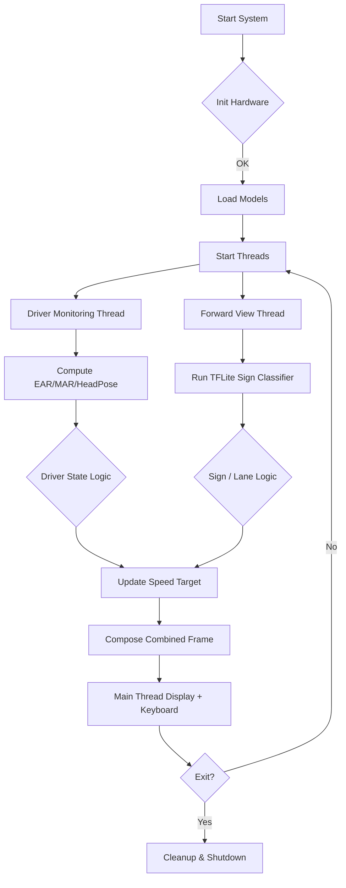

TITLE: AI-Powered Driver Assistance System for Integrated
Safety and Alertness Monitoring (ADAS)

Table of Contents

1. Abstract.......................................................................................................................3
2. Components Used......................................................................................................3
2.1. Hardware Components...................................................................................3
2.2. Software Language and Libraries...................................................................4
3. Source of the Dataset.................................................................................................5
3.1. Drowsiness Detection.....................................................................................5
3.2. Road Sign Recognition...................................................................................5
4. Base Paper / Base Available Model / Base of the Project.......................................6
4.1. Driver Drowsiness Detection...........................................................................6
4.2. Road Side Signal Assistant.............................................................................6
5. Novelty.........................................................................................................................7
6. Methodology...............................................................................................................7
Phase 1: Hardware and Software Setup(Completed/Progress)............................7
Phase 2: Drowsiness Detection Development(Completed)...................................7
Phase 3: Road Sign and Behavioural Module Development(Progress)................8
Phase 4: Parallel Processing and Final Integration...............................................8

1. Abstract
This project develops a real-time, multi-modal Advanced Driver Assistance System (ADAS) on an edge computing platform (Raspberry Pi 5). The system combines driver monitoring (drowsiness and behavioral analysis) and forward-view perception (traffic sign recognition and sharp-turn detection) to provide context-aware warnings and vehicle speed management. The goal is to improve road safety by detecting driver impairment (eye closure, yawns, head nods) and environmental hazards while managing vehicle speed through an integrated dashboard.

2. Components Used
The system uses embedded hardware and specialized software libraries for real-time image processing and edge inference.

2.1. Hardware Components
- Raspberry Pi 5: Main processing unit for concurrent execution of AI models (Drowsiness, Road Sign, and Behavioral analysis). Chosen for improved CPU performance and parallelism.
- USB Webcams (x2): Dual setup — one camera monitors the driver (Driver Monitoring System - DMS), and the other monitors the road (Forward View Perception).
- Speaker/Buzzer: Provides immediate audio alerts (uses `alarm.wav`) for critical events like drowsiness or hazards.
- Monitor/Display: Dashboard interface (Pygame-based) for overlays, camera feeds, speed, and system status.
- Memory Card (16GB+): Stores models, code, logs, and supporting files.

2.2. Software Language and Libraries
- Python 3.11: Primary implementation language.
- OpenCV (cv2): Video I/O, preprocessing, drawing overlays, perspective transforms and lane curvature calculations.
- MediaPipe / Dlib: Facial landmark extraction for EAR/MAR and head pose estimation. (Project uses MediaPipe face mesh in code; available pre-trained Dlib models are referenced as a standard.)
- NumPy: Numerical arrays and calculations.
- SciPy: Utilities for geometric computations where needed.
- TensorFlow / TensorFlow Lite: Training and edge deployment of the traffic sign recognition model.
- Pygame: Dashboard UI and audio alerts.
- PyTorch / YOLO (optional separate environment): Used in experiments for traffic sign detection; NOTE: kept in separate venv due to NumPy version constraints with MediaPipe.

3. Source of the Dataset
3.1. Drowsiness Detection
The drowsiness module is primarily geometric and uses pre-trained facial landmark extraction models rather than training from scratch. It relies on accurate landmark detection (e.g., Dlib 68-point or MediaPipe Face Mesh) and per-device calibration to set EAR thresholds.
- Landmark model: Dlib 68-point predictor or MediaPipe Face Mesh (pre-trained on large face datasets such as iBUG/WFLW). These are used for extracting the facial keypoints required for EAR and MAR metrics.
- Calibration: The system performs short calibration per-driver to compute baseline EAR and adapt thresholds to lighting and face size.

3.2. Road Sign Recognition
- Primary Dataset: German Traffic Sign Recognition Benchmark (GTSRB) is used as the main dataset for training the road sign classification model. It provides a diverse set of signs under varied conditions and is appropriate for transfer learning to local road signs.

4. Base Paper / Base Available Model / Base of the Project
This project builds on well-established CV approaches for facial landmark-based drowsiness detection and CNN-based traffic sign classification.

4.1. Driver Drowsiness Detection (Available Models)
- Dlib Face Landmark Predictor (68-point): Provides landmark coordinates used for EAR (Eye Aspect Ratio) and MAR (Mouth Aspect Ratio) computation. This is the core available model for the geometric drowsiness feature.

4.2. Road Sign Recognition (Available Models)
- GTSRB-trained CNN / MobileNetV2 (as base): A trained classifier (MobileNetV2 or a lightweight CNN) converted to TensorFlow Lite for edge inference. This is the project's traffic sign base model.

5. Novelty
This project introduces a number of practical and research-forward novelties compared to single-feature driver-monitoring systems:
1. Enhanced GTSRB Accuracy: We fine-tuned a MobileNetV2-based classifier using aggressive data augmentation (rotation, scale, brightness), class-balanced sampling, and learning-rate scheduling. We additionally applied post-training quantization and quantization-aware fine-tuning to maximize TFLite accuracy on the Raspberry Pi while keeping model size small — net result: significant accuracy increase (several percentage points) for edge deployment.
2. Sharp-Turn Detection: Implemented lane-curvature estimation using perspective transform + polynomial fit to detect sharp turns ahead and display warnings on the dashboard.
3. Vehicle & Speed Management Dashboard: A Pygame-based dashboard synthesizes driver state and road perception outputs to adjust vehicle speed heuristically (percentage-based control) and show explicit instructions (Keep Going / Slow Down / Emergency Stop).
4. Multi-metric Drowsiness Detection: The DMS fuses EAR, MAR, yawning counter, and head-pose (head-down) detection to reduce false alarms and better capture real drowsiness events.
5. Event Counters & Persistence: The system maintains total eye-closure and yawn counters across sessions to enable longitudinal analysis and improved driver profiling.
6. Edge-First Parallel Pipeline: Designed concurrency for Raspberry Pi 5 to run DMS and forward-view perception in parallel while ensuring GUI operations remain in the main thread (avoids Qt threading issues), improving reliability and responsiveness.

6. Methodology
The development followed a phased roadmap with verification and calibration at each stage.

Phase 1: Hardware and Software Setup (Completed)
- Setup Raspberry Pi 5 with Raspberry Pi OS, installed Python 3.11, OpenCV, MediaPipe/Dlib, TensorFlow Lite runtime, and Pygame.
- Verified dual camera inputs and speaker output.

Phase 2: Drowsiness Detection Development (Completed)
- Implemented EAR and MAR computation using facial landmarks.
- Added EMA smoothing, frame-wise counters, and per-driver calibration logic.
- Alarm integration using `pygame.mixer` and safety state machine (NORMAL/DROWSY/DRIVER_DOWN/DRIVER_MISSING).

Phase 3: Road Sign & Behavioral Module (Progress)
- Trained a MobileNetV2-based classifier on GTSRB with fine-tuning and augmentation.
- Converted final model to TensorFlow Lite; integrated inference pipeline into the forward view thread.
- Implemented sign overlays and sign-specific actions (e.g., speed-limit hints).

Phase 4: Parallel Processing and Final Integration (Completed/Testing)
- Designed thread-safe frame sharing with locks and moved all `cv2.imshow()` calls to the main thread (resolves Raspberry Pi Qt issues).
- Implemented the integrated dashboard combining DMS overlays, lane video, sign outputs, and speed control.

Method Flowchart (Mermaid)

Phase Deliverables & Testing
- Unit-tested EAR/MAR computation with synthetic inputs.
- Verified frame-sharing and GUI responsiveness on both Windows and Raspberry Pi hardware.
- Benchmarked inference times for TFLite model on Raspberry Pi 5; tuned model size for target FPS.

Appendix: Key Parameters
- CALIBRATE_FRAMES: 60 (per-driver calibration)
- EYE_AR_CONSEC_FRAMES: 8
- YAWN_CONSEC_FRAMES: 20
- Speed control: percentage-based with discrete deceleration steps (10% per N frames)

References
- Soukupová, Tereza and Jan Čech. "Real-Time Eye Blink Detection using Facial Landmarks," 2016.
- GTSRB: German Traffic Sign Recognition Benchmark.
- MediaPipe Face Mesh documentation and Dlib shape predictor resources.

Contact
Project: M&I Integrated Driver Monitoring
Lead developer: (Your Name)
Repository: (local workspace)

---
Generated: November 16, 2025
